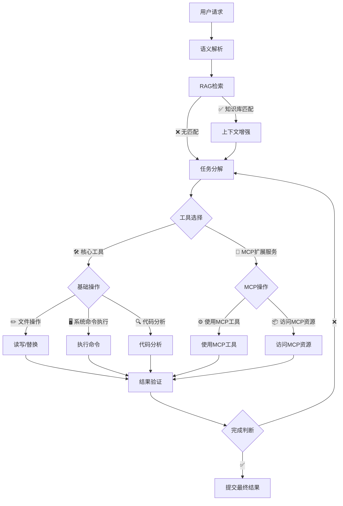
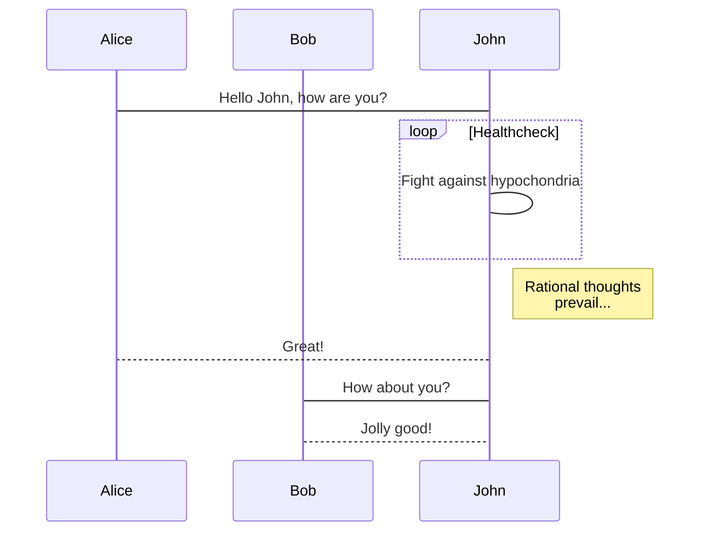
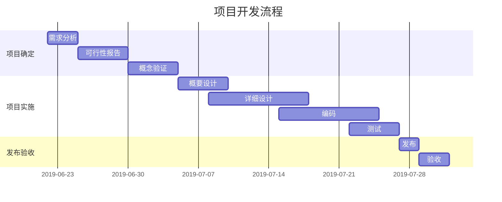

## 文本加粗

```md
这是一个 **文本加粗** 的展示
```

这是一个 **文本加粗** 的展示

## 文本倾斜

```md
这是一个 _文本倾斜_ 的展示
```

这是一个 _文本倾斜_ 的展示

## 文本删除

```md
这是一个 ~~文本删除~~ 的展示
```

这是一个 ~~文本删除~~ 的展示

## 行内代码

```md
`php` 是全宇宙最好的编程语言
```

`php` 是全宇宙最好的编程语言

## 引用

```md
> 这是一个引用
```

> 这是一个引用

## 有序列表

网页开发流程：
```md
1. 需求分析  
2. 架构设计  
3. UI 原型设计  
4. 前端开发  
5. 后端开发  
6. 接口联调  
7. 功能测试  
8. 上线部署  
9. 监控与维护
```
网页开发流程：
1. 需求分析  
2. 架构设计  
3. UI 原型设计  
4. 前端开发  
5. 后端开发  
6. 接口联调  
7. 功能测试  
8. 上线部署  
9. 监控与维护

## 无序列表

```md
- 需求分析  
- 架构设计  
- UI 原型设计  
- 前端开发  
- 后端开发  
- 接口联调  
- 功能测试  
- 上线部署  
- 监控与维护
```

- 需求分析  
- 架构设计  
- UI 原型设计  
- 前端开发  
- 后端开发  
- 接口联调  
- 功能测试  
- 上线部署  
- 监控与维护

## 超链接

```md
[Google是全世界最好的搜索引擎](https://www.google.com)
```

[Google是全世界最好的搜索引擎](https://www.google.com)

## 3 行 3 列的表格

```md
| 步骤一     | 步骤二     | 步骤三     |
|------------|------------|------------|
| 需求分析   | 架构设计   | UI 原型设计 |
| 前端开发   | 后端开发   | 接口联调   |
| 功能测试   | 上线部署   | 监控与维护 |
```

| 步骤一     | 步骤二     | 步骤三     |
|------------|------------|------------|
| 需求分析   | 架构设计   | UI 原型设计 |
| 前端开发   | 后端开发   | 接口联调   |
| 功能测试   | 上线部署   | 监控与维护 |

## 代码块

```js
const table = [
  ["需求分析", "架构设计", "UI 原型设计"],
  ["前端开发", "后端开发", "接口联调"],
  ["功能测试", "上线部署", "监控与维护"]
];

// 输出表格
table.forEach(row => {
  console.log(row.join(" | "));
});
```

## H 标签

```md
<!-- H标签，页面标题即h1，不建议文章内使用h1标签 -->
## H2
### H3
#### H4
##### H5
```

<!-- H标签，页面标题即h1，不建议文章内使用h1标签 -->

## H2

### H3

#### H4

##### H5

## 视频播放

### iframe

- 倚天屠龙记 16:9
<div style="position: relative; width: 100%; padding-bottom: 56.25%; height: 0; overflow: hidden;">
  <iframe src="https://cdn.0163.eu.org/player?id=6"
    frameborder="0"
    allowfullscreen
    style="position: absolute; top: 0; left: 0; width: 100%; height: 100%;">
  </iframe>
</div>
  
- 成为昏君后我读心百官 9:16
<iframe src="https://cdn.0163.eu.org/player?id=527" class="responsive-iframe" frameborder="0" allowfullscreen></iframe>

<style>
.responsive-iframe {
  display: block;
  margin: 0 auto;
  width: 100%;
  height: auto;
  aspect-ratio: 9 / 16; /* 保证 9:16 比例 */
}

@media (min-width: 768px) {
  .responsive-iframe {
    width: 300px; /* 电脑上宽度限制为 300px */
  }
}

@media (min-width: 1024px) {
  .responsive-iframe {
    width: 400px; /* 大屏电脑限制为 400px */
  }
}
</style>


### 直接引用

- 肤白貌美大长腿

<video controls class="responsive-video">
  <source src="https://cdn.0163.eu.org/%E8%82%A4%E7%99%BD%E8%B2%8C%E7%BE%8E%E5%A4%A7%E9%95%BF%E8%85%BF.mp4" type="video/mp4">
</video>

<style>
.responsive-video {
  display: block;
  margin: 0 auto;
  max-width: 100%;
  height: auto;
}

@media (min-width: 768px) {
  /* 电脑端（大于768px）缩小宽度 */
  .responsive-video {
    max-width: 300px; /* 你可以调成400px或500px看效果 */
  }
}
</style>


  
- 凡人修仙传仙界篇-第1集_飞升仙界

<video controls style="display: block; margin: 0 auto; max-width: 100%; height: auto;">
  <source src="https://cdn.0163.eu.org/%E5%87%A1%E4%BA%BA%E4%BF%AE%E4%BB%99%E4%BC%A0%E4%BB%99%E7%95%8C%E7%AF%87-%E7%AC%AC1%E9%9B%86_%E9%A3%9E%E5%8D%87%E4%BB%99%E7%95%8C.ogg" type="video/ogg">
</video>


### 2. 书写一个质能守恒公式[^LaTeX]

$$
E=mc^2
$$

### 4. 高效绘制[流程图](https://github.com/knsv/mermaid#flowchart)



---

### 5. 高效绘制[序列图](https://github.com/knsv/mermaid#sequence-diagram)



---

### 6. 高效绘制[甘特图](https://github.com/knsv/mermaid#gantt-diagram)

> **甘特图**内在思想简单。基本是一条线条图，横轴表示时间，纵轴表示活动（项目），线条表示在整个期间上计划和实际的活动完成情况。它直观地表明任务计划在什么时候进行，及实际进展与计划要求的对比。



### 7. 支持图表

```echarts
{
  "backgroundColor": "#212121",
  "title": {
    "text": "「晚晴幽草轩」访问来源",
    "subtext": "2019 年 6 月份",
    "x": "center",
    "textStyle": {
      "color": "#f2f2f2"
    }
  },
  "tooltip": {
    "trigger": "item",
    "formatter": "{a} <br/>{b} : {c} ({d}%)"
  },
  "legend": {
    "orient": "vertical",
    "left": "left",
    "data": [
      "搜索引擎",
      "直接访问",
      "推荐",
      "其他",
      "社交平台"
    ],
    "textStyle": {
      "color": "#f2f2f2"
    }
  },
  "series": [
    {
      "name": "访问来源",
      "type": "pie",
      "radius": "55%",
      "center": [
        "50%",
        "60%"
      ],
      "data": [
        {
          "value": 10440,
          "name": "搜索引擎",
          "itemStyle": {
            "color": "#ef4136"
          }
        },
        {
          "value": 4770,
          "name": "直接访问"
        },
        {
          "value": 2430,
          "name": "推荐"
        },
        {
          "value": 342,
          "name": "其他"
        },
        {
          "value": 18,
          "name": "社交平台"
        }
      ],
      "itemStyle": {
        "emphasis": {
          "shadowBlur": 10,
          "shadowOffsetX": 0,
          "shadowColor": "rgba(0, 0, 0, 0.5)"
        }
      }
    }
  ]
}
```

> **备注**：上述 echarts 图表📈，其数据，须使用严格的 **JSON** 格式；您可使用 JSON.stringify(data)，将对象传换从而得标准数据，即可正常使用。

